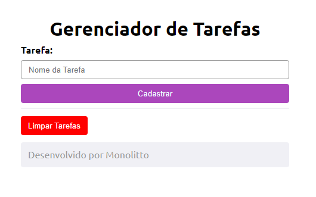

# Índice

[Projeto - Tela De Cadastro](#projeto---tela-de-cadastro)

[Descrição](#descri%C3%A7%C3%A3o)

[Fontes e Tecnologias Utilizadas](#fontes-e-tecnologias-utilizadas)

[Autor](#autor)

# Descrição

Este código cria uma página da web de gerenciamento de tarefas simples. Os usuários podem adicionar tarefas através de um formulário, ver a lista de tarefas já adicionadas e apagar todas as tarefas com um botão de "Limpar Tarefas".

# Introdução

### HTML

* Título da Página: O título da página é "Gerenciador de Tarefas", como indicado pela tag "title".
* Formulário para Adicionar Tarefas: Há um formulário para adicionar novas tarefas. Ele inclui um campo de entrada de texto onde você pode digitar o nome da tarefa e um botão para enviar o formulário.
* Lista de Tarefas: A página exibe uma lista de tarefas se houver tarefas armazenadas na sessão PHP. Elas são mostradas como itens de lista ("li") dentro de uma lista não ordenada ("ul").
* Botão para Limpar Tarefas: Há um botão que permite ao usuário limpar todas as tarefas da lista. O botão envia um formulário para a página com um campo oculto indicando que as tarefas devem ser apagadas.
* Rodapé: No final da página, há um rodapé simples com uma mensagem de desenvolvimento ("Desenvolvido por Monolitto").

### CSS

* Estilos da Lista de Tarefas: Os itens da lista têm um fundo colorido, texto branco, bordas arredondadas e transições quando o mouse passa sobre eles, dando uma sensação interativa.
* Estilos do Rodapé: O rodapé tem um fundo cinza, bordas arredondadas e um texto cinza escuro para dar uma aparência discreta.

# Fontes e Tecnologias Utilizadas

* PHP
* CSS3
* [Google Fontes](https://fonts.google.com/)
* [HTML Colors](https://htmlcolors.com/)

# Autor do README

<a href="https://github.com/SamuelCmdeFarias">
 <h2>Samuel Camargo</h2></a> 
  

# Autor do Código

[<h2>Monolito PHP</h2>](https://www.youtube.com/watch?v=dJ49I-QYYUk&ab_channel=MonolitoPHP)